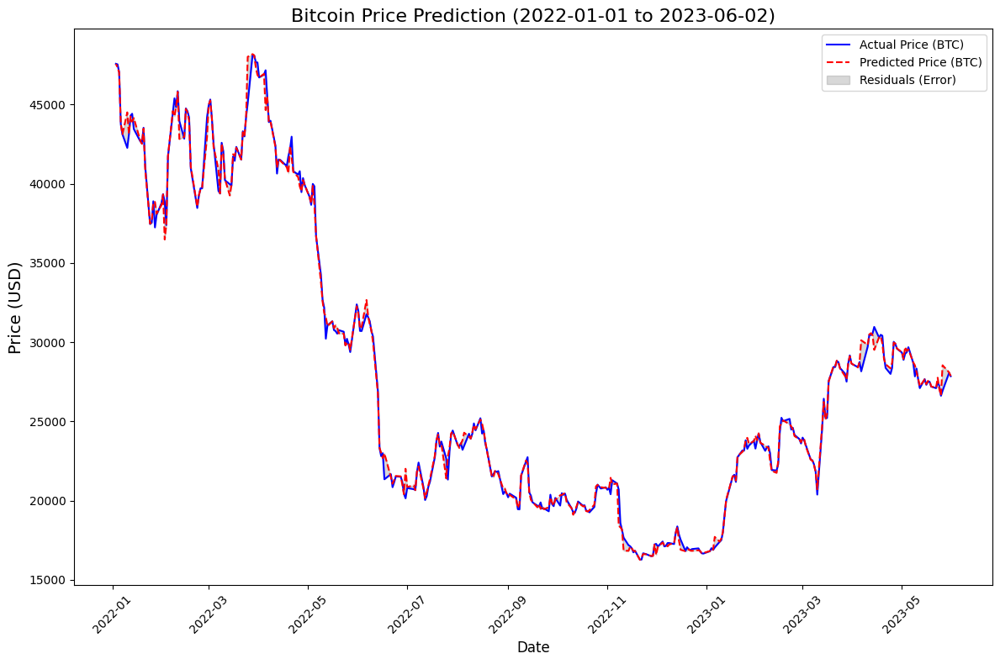
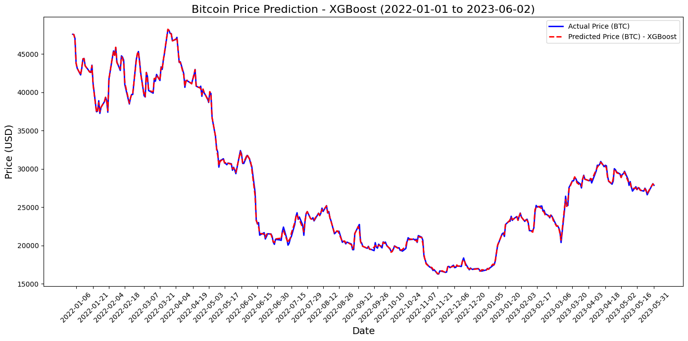
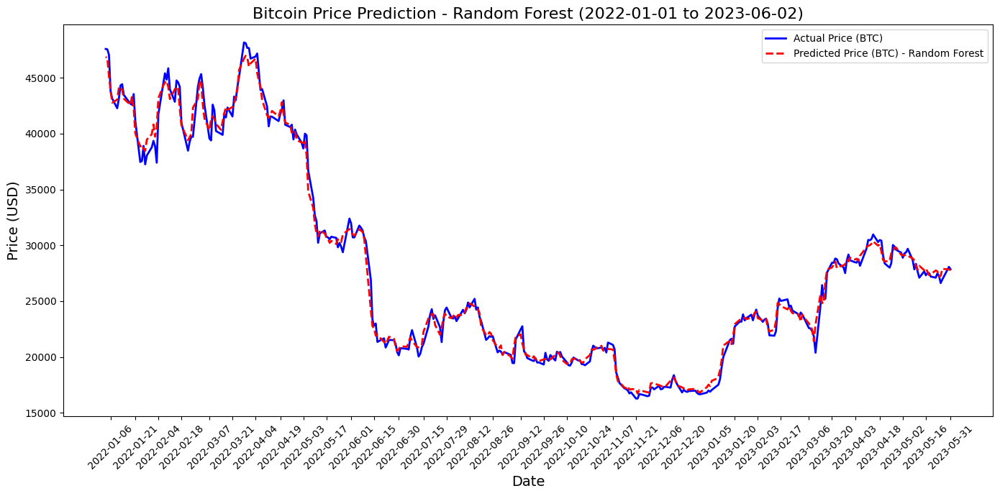

# SKN09 - EDA 3Team

> **SK Networks AI CAMP 9기**  
> **개발기간:** 2025.01.22 ~ 2025.02.02  
> **팀명:** 경제 콜럼버스  

---

## 📢 Team Introduction (**경제 콜럼버스 (SKN09-eda-3Team)**)
| 이름      | GitHub ID                          |
|-----------|------------------------------------|
| 🧑‍💻 김정훈  | [@Zayden0815](https://github.com/Zayden0815) |
| 👩‍💻 김하늘  | [@nini12091](https://github.com/nini12091)        |
| 👩‍💻 이광운  | [@Leegwangwoon](https://github.com/Leegwangwoon)          |

---

## 🎯 Project Introduction (프로젝트 개요)

### 프로젝트명
**머신러닝을 적용한 주식(S&P500), 가상화폐(비트코인) 가격 예측**

### 프로젝트 소개
📈 **주식(S&P 500)**, ₿ **비트코인(BTC)** 의 시계열 데이터를 기반으로 각 자산의 가격을 머신러닝 기법을 활용해 **예측**하고 **시각화 자료**를 통해 확인합니다.

### 프로젝트 주제 선정 배경
직전 프로젝트인 EDA 프로젝트의 결과로 분석한 경제 요소지표중 두 개의 상관관계가 상대적으로 높다는 것을 파악했고, 이를 기반으로 두 데이터를 활용하여 가격을 예측하는 방향으로 후속 프로젝트 주제를 선정했다.

### ✅ 프로젝트 목표
1. **자산의 가격 분석**  
   주요 자산들의 가격 데이터를 기반하여 **각 자산 간의 가격을 예측**하고, 결과를 **시각적으로 표현**합니다.

2. **각 모델의 성능지표 향상**  
   사용한 모델들의 결과를 파악하고 그 결과를 개선시킬 수 있는 방법을 적용하여 성능된 향상을 얻습니다.
   사용 모델별 점수와 개선 방향은 아래 표와 부수적인 설명을 통하여 제공합니다.
---

## 🚀 Getting Started 

### 사용 모델 
```python
import xgboost as xgb
from sklearn.ensemble import RandomForestRegressor
from sklearn.ensemble import GradientBoostingRegressor
from sklearn.linear_model import LinearRegression
from lightgbm import LGBMRegressor
```
---
### 코드 이슈: `GradientBoostingRegressor` 버전 이슈

#### 문제 발생
`from sklearn.ensemble import GradientBoostingRegressor`에서 버전 호환성 문제로 오류가 발생. 이 문제는 **최신버전**의 `scikit-learn`에서 발생할 수 있습니다.

#### 해결 방법

1. **특정 버전 설치**  
   `scikit-learn` 1.3.2 버전에서 동작이 확인되었습니다. 해당 버전을 설치하려면 아래 명령어를 사용하세요:
   
   ```bash
   pip install scikit-learn==1.3.2
   
2. **파이썬 가상 환경 생성 후 설치**  
   파이썬 가상 환경을 새로 만들어서 해당 버전을 설치하면 충돌을 피할 수 있습니다. 아래 절차를 따라 새로운 가상 환경을 생성하고 필요한 라이브러리를 설치하세요:

   ```bash
   # 가상 환경 생성
   python -m venv myenv

   # 가상 환경 활성화 (Windows)
   myenv\Scripts\activate

   # 가상 환경 활성화 (Mac/Linux)
   source myenv/bin/activate

   # 필요한 라이브러리 설치
   pip install scikit-learn==1.3.2
---
### 시각화 자료
#### XGBoost

#### XGBoost - 최적화

#### Random Forest



### 실험 결과
# Bitcoin Price Prediction - Model Comparison
### 모델 비교
| **모델**                    | **사용된 알고리즘**                                | **하이퍼파라미터 튜닝**     | **RMSE**              | **주요 특징**                                                                 |
|---------------------------|-------------------------------------------------|------------------------|----------------------|---------------------------------------------------------------------------|
| **1. XGBoost (기본)**       | XGBoost                                          | x                      | 𝑅𝑀𝑆𝐸:  580.0029918279143    | - 기본 XGBoost 회귀 모델<br> - 기본 학습률과 트리 개수                      |
| **2. XGBoost (GridSearch)** | XGBoost                                          | GridSearchCV            | 𝑅𝑀𝑆𝐸: 167.50863485151848    | - `GridSearchCV`로 최적 파라미터 튜닝<br> - 교차 검증을 통한 최적화          |
| **3. Random Forest**       | 랜덤 포레스트 (RandomForestRegressor)            | GridSearchCV            | 𝑅𝑀𝑆𝐸: 697.7323878267981     | - 앙상블 모델<br> - 여러 트리를 결합하여 예측<br> - 비선형 관계에 강함         |
| **4. Gradient Boosting**   | 그래디언트 부스팅 (GradientBoostingRegressor)     | 없음                    | 𝑅𝑀𝑆𝐸: [값 입력]    | - 부스팅 기법을 사용한 앙상블 모델<br> - 예측 정확도가 높고, 과적합 방지에 유리 |
| **5. Linear Regression**   | 선형 회귀 (LinearRegression)                     | 없음                    | 𝑅𝑀𝑆𝐸: [값 입력]    | - 선형 관계 가정<br> - 상대적으로 단순하고 빠른 모델                        |
| **6. LGBMRegressor**       | LightGBM (LGBMRegressor)                        | 없음                    | 𝑅𝑀𝑆𝐸: [값 입력]    | - 빠르고 효율적인 학습<br> - 대규모 데이터셋에서 뛰어난 성능               |

---


## 🖥️ Server Specifications (서버 사양) -> 얘는 뺴는게 맞을듯?

| 사양               | 서버 1                      | 서버 2(랩탑)   수정하기                |
|--------------------|-----------------------------|-----------------------------|
| **CPU**            | Intel Core i7 11th Gen       | Intel Core i5 13th Gen           |
| **RAM**            | 32GB                       | 32GB                    |
| **Storage**        | 512GB SSD                   |512GB SSD                       |
| **Operating System**| window                  | window                 |
| **GPU**            | NVIDIA RTX 3050           | iris(R) Xe Graphics            |

